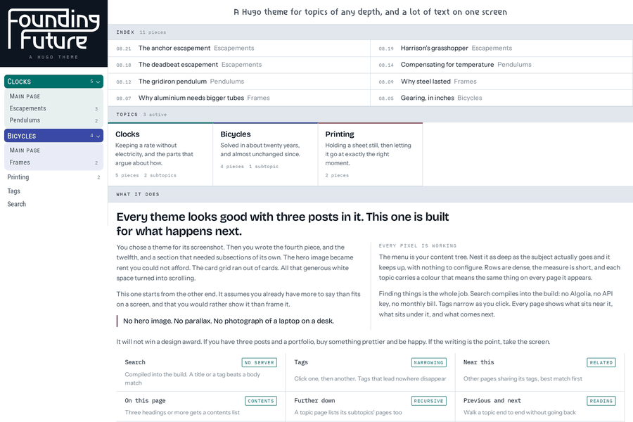
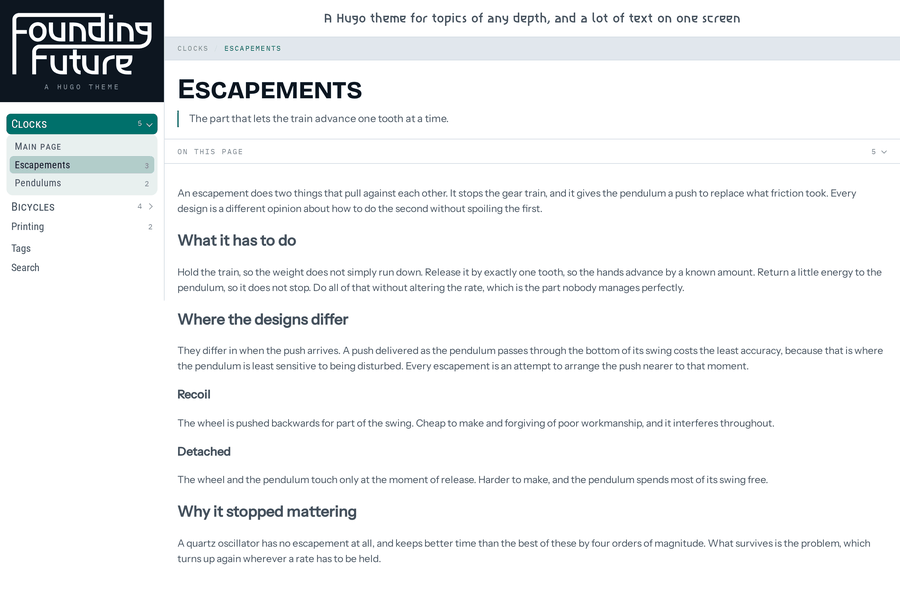
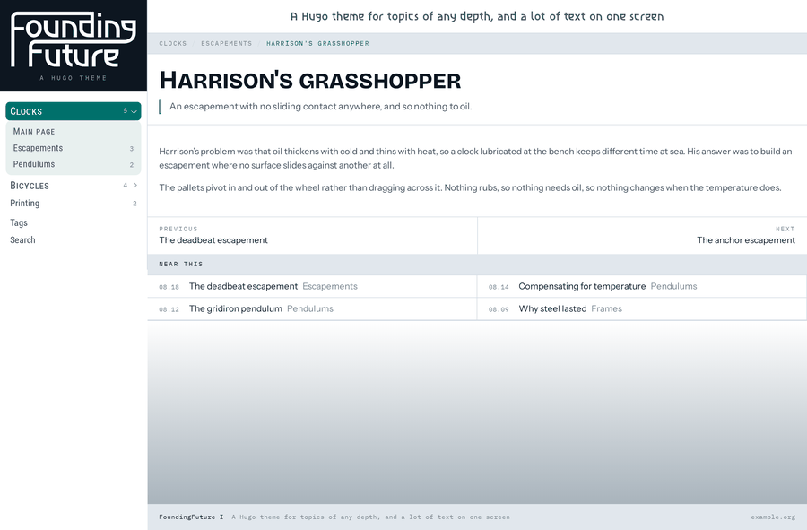
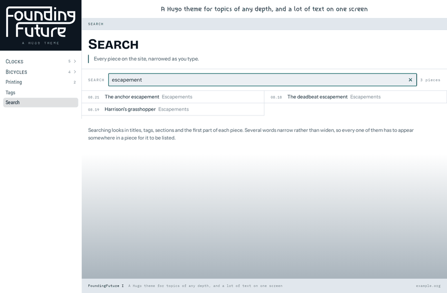
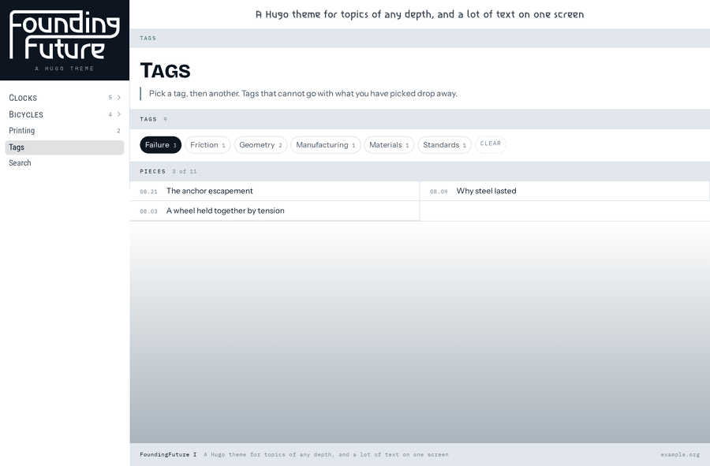
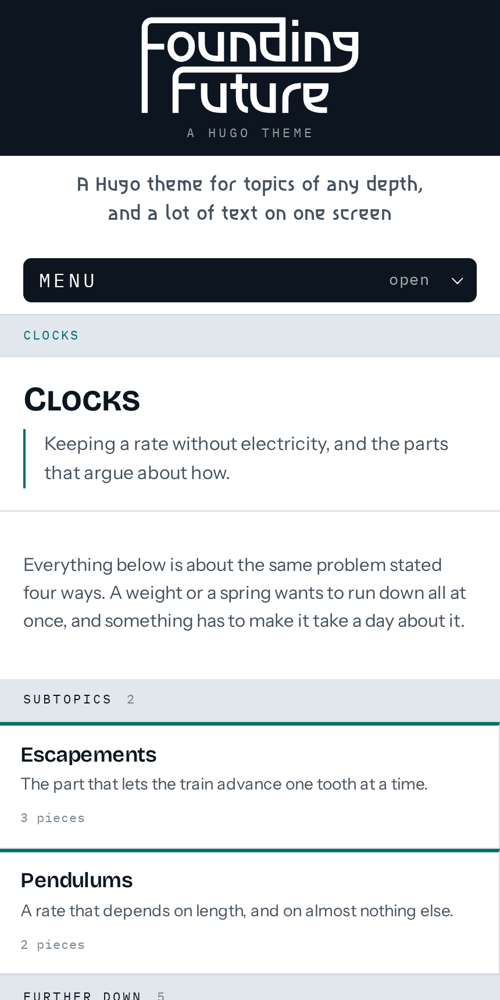

# FoundingFuture I

Every theme looks good with three posts in it. This one is built for what
happens next.

Your folders become the menu, however deep they go, with nothing to
configure. Each topic carries a colour that means the same thing on every
page. Menu items in small capitals have more inside; plain ones are pages.
Two small scripts run, both for finding things, and every page works without
them.

**[See it running](https://foundingfuture.com/template/)**

<p align="center">
  
</p>

<table>
<tr>
<td width="50%"><br>
    Three levels down. The menu is the content tree.</td>
<td width="50%"><br>
    One piece: contents, linked headings, previous and next.</td>
</tr>
<tr>
<td><br>
    Search, mid-query. The index compiles into the build.</td>
<td><br>
    Tags after one click. Dead ends have gone.</td>
</tr>
</table>

<p align="center">
  <br>
  <em>At 430 pixels the rail folds into a bar.</em>
</p>

## Dropping it into a site you already have

Set `theme` and build. The theme names none of your folders and requires no
parameter, so an existing site keeps the structure it has.

```toml
theme = "foundingfuture-i"
```

The menu is `site.Home.Sections`: every top-level section, and everything
under it, as deep as your content goes. Hugo's own advice to theme authors
is not to hardcode section names, so `content/posts/` and `content/docs/`
appear under those names, and a folder you add tomorrow appears by itself.

Anything you do set is additive:

- `params.tagline` puts a line across the top. Without it there is no band.
- `params.palette` gives the top-level sections their colours in order.
- `params.extraNav` adds rows below the tree, for pages that are not
  sections.

## Keeping a section out of the menu

Two questions decide it, and both are Hugo's rather than the theme's.

**Is it a section at all?** A folder holding `_index.md` is a section, so it
is a menu item. A folder holding `index.md` is a single page, and the files
beside it are that page's resources. An article that offers a download wants
the second shape, and then there is nothing to exclude:

```text
content/software/the-font/
  index.md              the article
  specimen.woff2        the download
```

**A real section you want reachable but unlisted?** Say so in its front
matter. It keeps its url, its pages stay in search, and the menu skips it.

```yaml
build:
  list: never
  render: always
```

## Tags

Tag a piece in its front matter and the theme does the rest.

```yaml
tags: [materials, precision, temperature]
```

`/tags/` lists every tag. Pick one and the pieces narrow; pick another and
they narrow again. A tag that appears in none of what is left drops away,
which is what makes the next click obvious. The selection is in the URL, so
a narrowed view can be sent to someone.

Every tag is also a real page at `/tags/<tag>/`, and that is what a browser
without JavaScript follows. The narrowing is a script; the tag pages are not.

**One thing will stop it working silently.** If your site's config lists
`taxonomy` or `term` in `disableKinds`, the tag pages are never built and
nothing reports it. Remove them:

```toml
disableKinds = ["rss", "sitemap"]   # not "taxonomy", not "term"
```

## Finding things

A site with a lot of pieces has one real problem, which is getting a reader
to the one they want. Six things address it, and none of them needs
configuring.

**Search.** Give a page `layout: search` in its front matter and it becomes
one. The index is built at build time and written out as its own file, so
the page stays small and nothing is fetched until the reader opens it.
Titles and tags outrank body text, and several words narrow rather than
widen.

```yaml
---
title: "Search"
layout: search
---
```

**Near this.** Under each piece, up to four others that share its tags,
ranked by how much they share. Tune it with a `[related]` block in your
config, or leave it, because the theme ships one.

**Previous and next.** Reading straight through a topic, rather than going
back to the list each time.

**On this page.** A piece with three headings or more folds out its own
contents. Fewer than three is not a shape worth showing.

**A link to every heading.** Hover a heading and a `#` appears, so any part
of a long piece can be sent to someone.

**Everything further down.** A topic lists its own pieces, then the pieces
in its subtopics beneath them, each labelled with where it came from. A
reader on a topic page sees the whole topic, not just its top layer.

Sitemaps and feeds are Hugo's, and the theme leaves them switched on. If
your config lists `sitemap` or `rss` in `disableKinds`, they are not built.

## Pictures

`gallery` puts a row of pictures on the page. It snaps as it scrolls.

```

/img/shots/front.png | The front page
/img/shots/depth.png | Three levels down

```

One picture per line, the path first and the caption after a pipe. The
caption doubles as the alt text. Paths run through the theme's url helper,
so they survive a site served under a subpath.

It is a grid with `scroll-snap` on it. No script, no timer, and no slide
moving while somebody is still looking at it. A wheel, a trackpad, a touch
and the arrow keys all work the way they already do, because the browser is
doing the scrolling. The strip takes focus, so it is reachable by keyboard.

`/screenshots/` in the example site is the shortcode carrying the pictures
above.

## The line at the foot

One line, at the foot of the viewport, carrying your site's name, its
tagline and its domains. A short page still puts it on the screen's last
line.

Replace it by writing your own at `layouts/partials/footer.html`. Hugo
uses yours instead, with nothing to configure. Crediting Hugo and this
theme is one thing you might put there:

```html
<footer class="foot">
  <span>This website was generated using
    <a href="https://gohugo.io/">Hugo</a> and the
    <a href="{{ site.Params.themeURL }}">FoundingFuture&nbsp;I</a> theme.</span>
</footer>
```

The theme does not ship that line itself. Attribution you cannot remove
is not a courtesy, and the licence does not ask for one.

## Making it yours

The theme ships a plain wordmark. Put your own at
`layouts/partials/wordmark.html` in your site and Hugo will use it instead.
Nothing else needs overriding to look like your own.

## Changing the words

Every word the theme puts on a page comes from `i18n/en.toml`. Ship your own
and Hugo merges it over the theme's, key by key, so you change one word
without restating the rest.

```toml
# your-site/i18n/en.toml
[sections]
other = "Sections"

[piecesTitle]
other = "Pages"
```

The defaults read as a personal publishing site, because that is what the
theme was cut for. A documentation site will want "Sections" where the
theme says "Topics".

## Licence

MIT for the theme. The typefaces travel under the SIL Open Font License, and
their licences ship beside them in `static/fonts/`.

## Working on the theme

`docs/layout.md` explains how the frame is put together, and the two things
that have caught every layout fault so far: `display:contents` promoting
every child to a grid item, and an `auto` column growing with a spanning
item rather than with its own contents.

Read it before adding anything to `baseof.html`.

