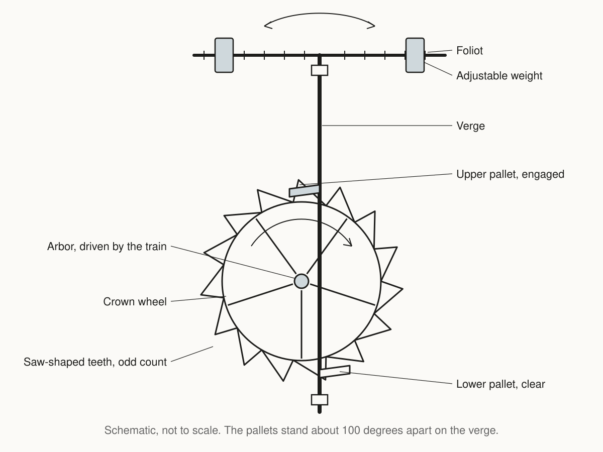

The verge escapement is the oldest known mechanical escapement. It ran European
tower clocks from about 1300. A vertical rod called the verge carries two pallets
set about 100 degrees apart. A crown wheel with an odd number of saw-shaped teeth
pushes those pallets alternately. The verge swings back and forth as they escape.

<!--more-->

## Parts

Verge
: A vertical rod that carries the two pallets and turns through a small arc at
  each beat.

Pallet
: One of two flags on the verge, set about 100 degrees apart. Each pallet meets
  the crown wheel in turn.

Crown wheel
: A wheel with saw-shaped teeth standing up from its rim. The tooth count is odd,
  commonly 13 to 15.

Foliot
: A horizontal bar with adjustable weights, mounted on top of the verge. A balance
  wheel serves the same role in later clocks.

## Rate

The foliot or balance wheel has no natural period. Its rate depends on the drive
torque. Any change in the weight, the spring or the friction of the train
changes the rate. Typical daily error before the pendulum was 15 minutes or
more.

Huygens applied the pendulum to a verge in 1656. A pendulum has a natural
period. Daily error fell to about 15 seconds.

## Recoil

Recoil is the crown wheel briefly reversing at each beat. The verge keeps
turning after a tooth escapes. The incoming pallet then pushes the next tooth
backwards before the wheel moves forward again. The reversal is visible on the
crown wheel.

## Replacement

The [anchor escapement]({}) replaced the
verge after 1670.
